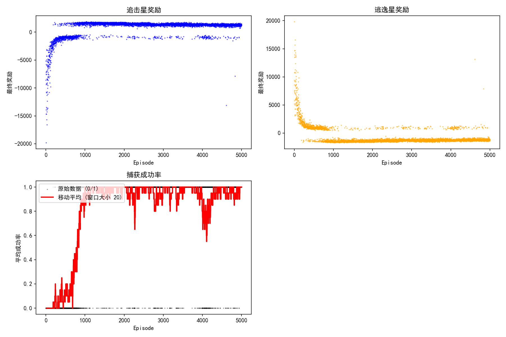
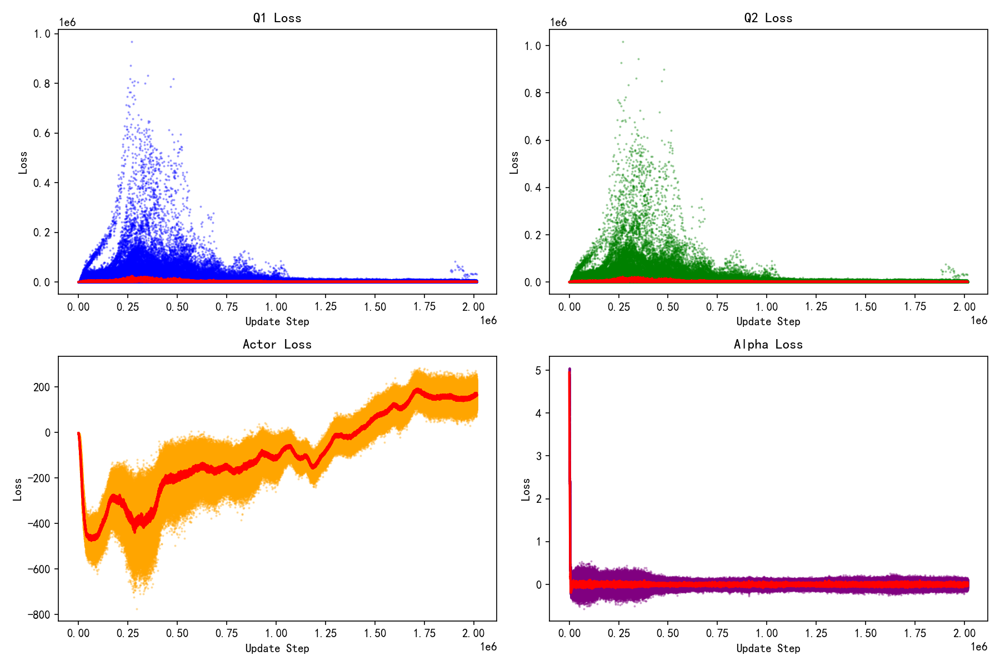
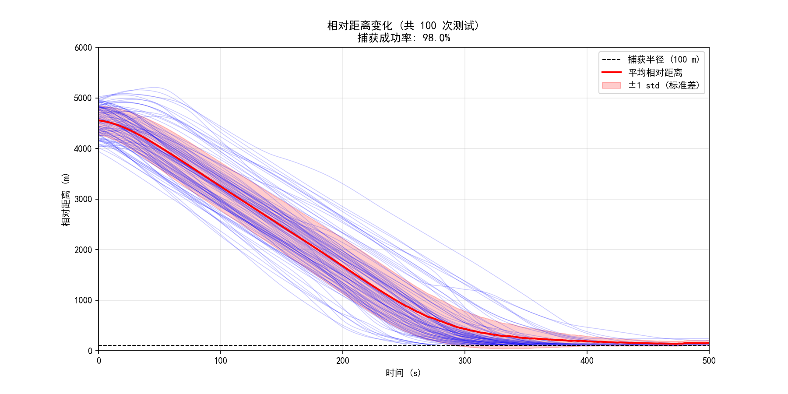
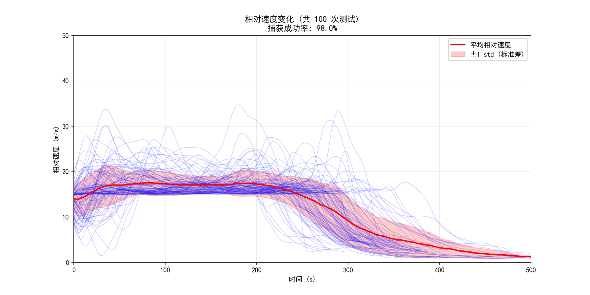
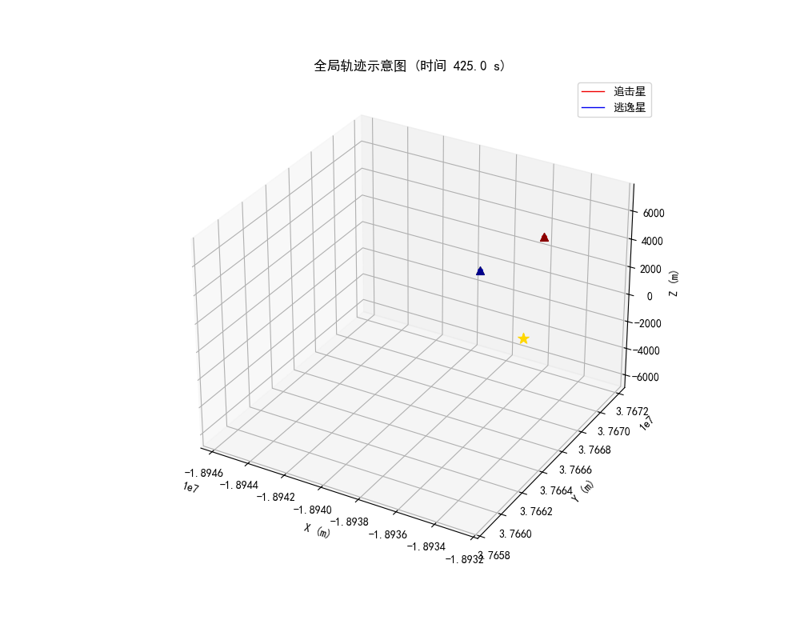
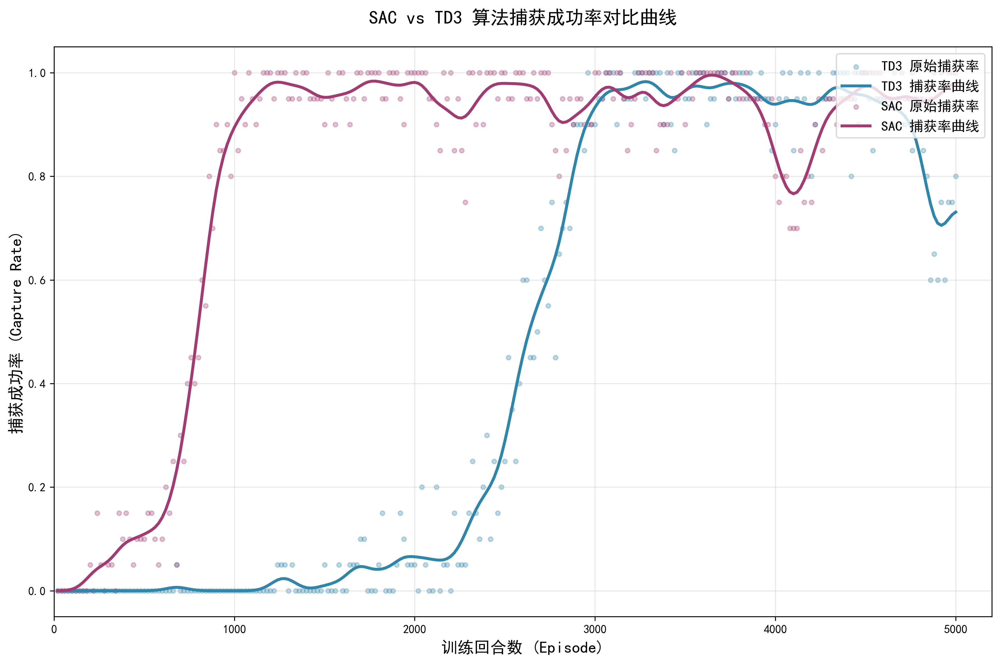

# 🧪 基于SAC强化学习算法的航天器一对一追逃博弈研究

> **项目描述**：针对地球同步轨道（GEO）上的一对一航天器追逃博弈问题，本文基于软行动者-评论家（Soft Actor-Critic，SAC）强化学习算法提出一种自主决策方法，以验证 SAC 算法在航天器轨道博弈中的有效性和适用性，为空间非合作目标自主拦截与规避任务提供新的设计思路。 

---

## 📌 目录
- [✨ 特性](#-特性)
- [📦 安装](#-安装)
- [🚀 快速开始](#-快速开始)
- [📊 实验结果](#-实验结果)
- [📚 引用](#-引用)
- [🤝 致谢](#-致谢)
- [📄 声明](声明)

---

## ✨ 特性

- **仿真环境构建**：基于CW方程构建训练和测试仿真环境，引入速度增量、燃料消耗与机动差距等系列工程约束。
- **强化学习算法**：主要采用SAC算法训练模型，同时以TD3算法训练的模型作为对比，经过相同蒙特卡洛测试得到结果。
- **奖励函数优化**：经过大量实验得到的最佳奖励函数，基于相对距离的密集惩罚项优化训练收敛速度，解决稀疏奖励学习困难的问题。
- **数据可视化**：模型训练与测试结束会自动生成可视化图表，包括训练过程曲线、成功率曲线、相对距离和相对速度变化曲线、航天器全局轨迹等。

---

## 📦 安装

### 环境要求
- Python 3.12+ & CUDA 13.0+
- 依赖包详见requirements.txt

### 推荐配置
 - CPU：Intel Core i7-13700K
 - GPU：NVIDIA RTX 4060
 - RAM：≥16GB

### 克隆与安装
```bash
git clone https://github.com/HuLingQAQ/SPEG-Base-SAC.git
cd SPEG-Base-SAC
pip install -r requirements.txt
```

---

## 🚀 快速开始

### 运行训练程序
```bash
python main.py
```

### 运行测试程序
```bash
python test.py
```
---

## 📊 实验结果

### 训练过程曲线展示



### 相对距离和相对速度变化曲线展示



### 航天器全局轨迹展示


### 算法对比展示


---

## 📚 引用

- [SAC算法](https://arxiv.org/abs/1812.05905)
- [TD3算法](https://arxiv.org/abs/1802.09477)

---

## 🤝 致谢

- 南京理工大学

---

## 📄 声明
- > 本项目由本人独立完成，是其毕业论文/研究课题的一部分。
- > 本项目归档落地于南京理工大学，南京理工大学有权查看和修改本项目所有文件。
